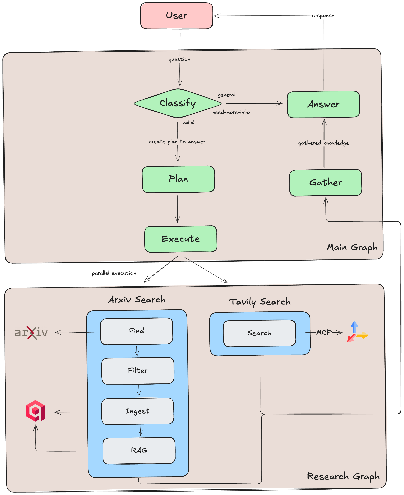

# Deep Research

## Overview

A **multi-agent AI research assistant**, powered by [Gemini 2.0 Flash](https://cloud.google.com/vertex-ai/generative-ai/docs/models/gemini/2-0-flash), built with [Google ADK](https://github.com/google/adk-python) that creates targeted research plans and automatically researches and answers your questions with comprehensive, well-cited responses.

## Workflow



The system processes user queries through four main phases:

1. **Classification** - Determines if the request is a valid research question, needs more information, or is a general query
2. **Planning** - Creates a targeted research plan with up to 3 steps, combining ArXiv searches for academic foundations and web searches for current developments
3. **Research Execution** - Runs the plan in parallel, with specialized agents handling:
   - **ArXiv Research**: Scans top 50 papers, selects top 3 based on abstracts, ingests them into [Qdrant](https://qdrant.tech/) with [OpenAI embeddings](https://platform.openai.com/docs/guides/embeddings), and performs RAG to extract relevant information while preserving URLs for citations
   - **Web Search**: Uses [Tavily MCP server](https://docs.tavily.com/documentation/mcp) to gather current information and developments
4. **Answer Synthesis** - Aggregates all findings and generates a comprehensive, well-cited response using the collected research data

## Getting Started

### Prerequisites

- `Python 3.11+`
- API keys for supported AI providers:
  - `Google AI API key` (for Gemini models)
  - `OpenAI API key` (for embeddings, Gemini embeddings not yet implemented)
  - `Tavily API key` (for web search)
- `Docker` (for local Qdrant setup) or access to a cloud vector database

### Setup

1. **Clone the repository:**
   ```bash
   git clone <repo-url>
   cd deep-research
   ```

2. **Install dependencies:**
   ```bash
   uv sync
   ```

3. **Configure environment variables:**
   
   Copy the example environment file:
   ```bash
   cp multi_tool_agent/.env.example multi_tool_agent/.env
   ```
   
   Edit the `.env` file to set your API keys:
   ```bash
   # Google AI Configuration
   GOOGLE_API_KEY=your_google_api_key_here
   
   # OpenAI and Search API Configuration
   OPENAI_API_KEY=your_openai_api_key_here
   TAVILY_API_KEY=your_tavily_api_key_here
   
   # Vector Store Configuration (default: Qdrant)
   VECTOR_STORE_TYPE=qdrant
   QDRANT_HOST=localhost
   QDRANT_PORT=6333
   QDRANT_GRPC_PORT=6334
   QDRANT_PREFER_GRPC=true
   
   # Logging Configuration
   LOG_LEVEL=INFO
   ```

4. **Set up vector database:**
   
   For local development with Docker:
   ```bash
   docker run -p 6333:6333 -p 6334:6334 qdrant/qdrant
   ```
   
   Alternatively, you can use a cloud provider (Qdrant Cloud, etc.) or implement your own vector database by extending the base classes in `multi_tool_agent/data/vector_stores/`.

5. **Execute the research system:**
   
   ```bash
   uv run adk run multi_tool_agent
   ```

## Usage Examples

### Basic Research Query
- *Who is the current president of the USA?*
- *Tell me the latest news on Elon Musk*
- *What are the latest developments in transformer architecture optimization?*

### Domain-Specific Research
- *How do quantum computing algorithms compare to classical machine learning for optimization problems?*
- *What are the current applications of CRISPR technology in treating genetic disorders?*
- *What are the latest developments in renewable energy storage solutions?*